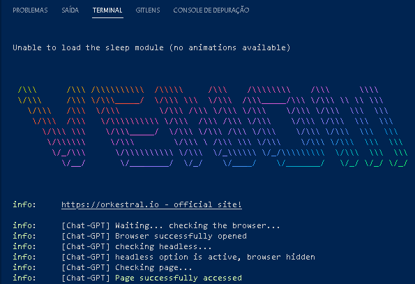
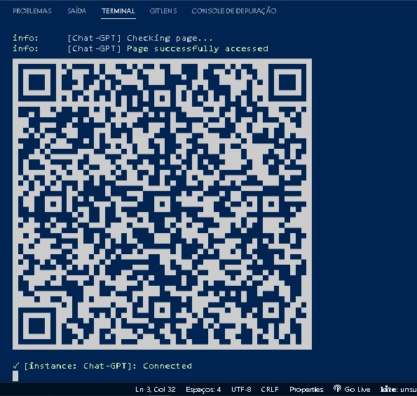

# Bot zap-gpt

O bot permite que o usuário interaja com o ChatGPT(Inteligência artificial)do Openai, via API, através de mensagens de texto no WhatsApp, fornecendo respostas a resposta para a pergunta do usuário.

## Tecnologias necessárias

- [OpenIA](https://beta.openai.com/)
- [venom-bot](https://github.com/orkestral/venom)
- [Node-js](https://nodejs.org/en/download/)

## Rodar o projeto
**Passo 01:**
Clone este projeto com o comando:

```bash
  git clone git@github.com:Lucas-Ed/bot-zap-gpt.git
```

**Passo 02:**
Instalação

vá até o diretório do projeto e no seu terminal,
instale agora as dependencias do projeto com o comando:

```bash
  npm install
```

## Variáveis de Ambiente
**Passo 02:**

Vá até o arquivo .env.example e renomeie-o para .env , e altere os valores necessários para seu funcionamento.

Dentro do arquivo iremos criar uma variável chamada OPENAI_KEY e colocaremos nossa api key aqui.


```bash
OPENAI_KEY=SUA-API-KEY
ORGANIZATION_ID=SEU-ORGANIZATION-ID
PHONE_NUMBER=SEU-NUMERO exemplo -> 553144448888@c.us
```
**Passo 03:**

Pegar a API Key e Organization ID na OpenAI.

A primeira coisa que precisamos aqui é da api key da openai, uma chave para autorização de envio das nossas requisições. 

Entre neste [link](http://bit.ly/3ZSfgC5) para pegar sua chave , é bem auto explicativo.


Para pegar o organization ID também é bem fácil, é só acessar este [link](bit.ly/3XJFWmF) e copiar o seu ID 


**Passo 04:**

Após configurado o seu .env com suas credenciais, é só rodar o comando:

```bash
  npm start
```

Você deverá ver:




**Passo 05:**

Conecte seu whatsapp, vá em 3 pontinhos canto direito superior-->Aparelhos conectados-->Conectar aparelho, e enparelhe com o QrCode.


**Passo 06:**
Por fim para interagir com o Bot-zap-gpt rode escreva no whatssapp para você mesmo `/bot` seguido de sua questão, ou para usar o Dall-e que gera imagem com I.A, escreva `/img` seguido escreva que imagem que você quer.

Para criar uma conversa no whatssapp com você mesmo basta criar um link: https://wa.me/55DDDSEUNUMERO
e clique nele que irá abrir um chat com você mesmo no whatssapp.

## Referência

 - [Artigo](http://bit.ly/3H06Obg)


